# second-brain

**Save UI inspiration from any app. A vision model curates it into a private wiki
and turns your taste into a DESIGN.md your coding agent builds from.**

<p align="center">
  
</p>

- **Save from anywhere.** Share a post from X, Instagram or LinkedIn, any web page,
  a screenshot or a photo, from your iPhone or Mac (Shortcut) or from Android and
  any desktop browser ([capture page](#android-and-desktop)).
- **Curated, not dumped.** A vision model reads the frames, measures the palette
  from pixels and files each capture under a topic: design, features, tools or
  practices. Code counts your recurring choices into a taste profile.
- **Your DESIGN.md.** The taste, or any saved style, becomes a
  [DESIGN.md](https://github.com/google-labs-code/design.md): tokens derived by
  code, contrast-checked, lint-clean. Claude reads it through the `second-brain`
  skill before it builds UI. getdesign.md gives you Stripe's DESIGN.md;
  second-brain gives you yours.

## How it works

A memory for things worth keeping: interface patterns and styles, feature ideas
and tools. You share something from your phone or computer. A model analyzes it,
files it under a topic and merges it into a Markdown wiki kept in a separate
private repository. Claude then reads it through the `second-brain` skill before
designing or building something. This repository is the engine.

What sets it apart and where it's going: [PRODUCT.md](PRODUCT.md) ·
[ROADMAP.md](ROADMAP.md).

```
capture page ──► inbox repository (queue/) ──► GitHub Actions (worker + model) ──► wiki repository
 or Shortcut        (or Supabase inbox)
                                                     │                                       │
                                                     ▼                                  git pull on the Mac
                                             ntfy push to the phone                          ▼
                                                                                    second-brain skill
```

## Quick start

You need a GitHub account with [gh](https://cli.github.com) logged in and an API
key for the model: a free [Ollama](https://ollama.com) key by default, or
OpenAI, Anthropic, Gemini or OpenRouter. Capture from an iPhone or Mac with
Shortcuts, an Android phone or any computer with a browser.

1. Get the engine:

   ```bash
   git clone https://github.com/albegosu/second-brain ~/Developer/second-brain
   cd ~/Developer/second-brain
   ```

2. Set everything up. It asks for the model provider and its key, creates your
   private wiki repository and a private inbox repository next to it, and wires
   them together:

   ```bash
   bin/setup
   ```

   It stops once to let you create a capture token on GitHub (a page it opens
   for you: select only the inbox repository, Contents: Read and write).
3. Connect your devices with what it prints: on an iPhone or Mac, open
   `shortcut/Save to second-brain (GitHub inbox).shortcut` and answer its two
   questions; on Android or a computer, scan the QR code (or open the link) and
   install the [capture page](#android-and-desktop).
4. Optionally, subscribe to the printed topic in the [ntfy](https://ntfy.sh) app
   to get a push when each capture is filed.
5. Share a post or a page. A few minutes later it's in your wiki, and Claude
   reads it through the `second-brain` skill.

The rest of this README explains the pieces, how to set them up by hand, and how
to run the worker on your own computer instead.

## The wiki

It lives in its own private repository (`second-brain-wiki`), together with the
workflows that write it; this repository only holds the engine. Captures quote
third-party posts, so that content stays private even if the engine is
published, and the worker runs there because GitHub Actions logs of a public
repository are public and print what was captured. Point `BRAIN_WIKI` at its
`wiki/` folder.

```
wiki/
  index.md                      map of topics; written by code
  taste.md                      recurring choices across captures; weekly
  DESIGN.md                     the same taste as design tokens; weekly
  usage.md                      what was built from which captures
  design/ features/ tools/      one page per topic
  practices/
  sources/2026-09/0007-….md     one note per capture
  sources/2026-09/0007-….jpg    what it looked like: up to 4 frames in time order
```

- **Categories:**
  - `design`: how an interface looks and moves. Topics that collect a look are
    named `style-*`.
  - `features`: what a product does for its user.
  - `tools`: tools, libraries and services.
  - `practices`: how to work (engineering practices, workflows with agents,
    lessons from articles).
- **Source notes** (`sources/`): written by code from what was extracted, with
  no reinterpretation. They hold your note, the patterns the model saw, the key
  ideas of an article or long text, the style with its pixel-measured palette,
  the post or page text, and a link to the original.
- **Topic pages:** the model picks the topic (reusing an existing one if it fits)
  and rewrites the page from all of its source notes, citing them as `[n]`. Pages
  are built for an agent about to implement something, with one block per item:
  patterns (**Use it when**, **How it works**, **Motion**, **Watch out**), styles
  as a DESIGN.md-like sheet (**Tokens**, **Composition**, **Do**, **Don't**),
  tools (**What it does**, **Use it when**, **Link**) or ideas (**Claim**, **Why it
  matters**, **How to apply**). A "Choosing" section follows when there are
  several, and "See also" links. The frontmatter, "See also", the sources list,
  the links a tool can use and the index are written by code, so a bad answer can
  at most spoil a text, never the navigation.
- **Nothing is guessed:** a capture with no image, video or text to read (a bare
  link, a one-line caption) isn't filed; you get a notification asking to share
  it again with a note.
- **Language:** everything in English.
- **Commits:** with `BRAIN_GIT_SYNC=1`, the worker commits and pushes the wiki
  folder to the repository that holds it after each capture. The commits are
  unsigned (it runs without a terminal for the GPG passphrase) and never touch
  anything outside that folder; code commits are yours.
- **Videos and frames:** the downloads stay in `data/`, out of git. The wiki keeps
  one small jpg per visual capture next to its note (up to four frames spread
  across the video, or the image), so an agent can look at the reference and not
  only read about it.

A note with `style: name` (or `estilo: name`) files the capture under
`design/style-name`, to collect a look across several captures.

After changing the analysis, this runs the model again over every capture the
current version hasn't analyzed (source notes record it as `analyzed`) and
rewrites the wiki. If it stops on a quota or network error, run it again and it
resumes:

```bash
python -m worker.run --reanalyze
```

Topic pages are regenerated from their sources, so manual edits to them don't
last; put lasting context in the capture's note.

**Lint pass.** Once a week, the wiki repository's `lint` workflow asks the model to review
the whole wiki: merge duplicate topics, split catch-alls, move misfiled captures
and relate topics. The code only applies proposals that keep every source note in
exactly one topic and only links topics within the same category (across
categories the model pairs things that merely share an area), rewrites the
affected pages and commits the result. Locally:

```bash
python -m worker.lint --dry-run        # print the validated plan, change nothing
python -m worker.lint                  # apply it
python -m worker.lint --recompose-all  # also rewrite every page from its sources
python -m worker.lint --no-plan        # skip the model's plan, only apply the rules
```

**Taste profile.** After the lint pass, `wiki/taste.md` is rewritten: the code
counts style traits, facets, animated properties, easing, background tone and
accent hues across every capture, and the model turns those counts and your
notes into a short default look and motion, each line citing its counts. The
skill starts from it when nothing else sets a style. `python -m worker.taste
--dry-run` prints the counts.

**DESIGN.md.** Collections like getdesign.md give an agent a brand's
[DESIGN.md](https://github.com/google-labs-code/design.md) (Stripe's, Linear's);
this one is yours. After the lint pass, `wiki/DESIGN.md` holds the taste in that
format, and any style topic gets its own on demand. The code derives every token:
measured palettes become color roles (primary, secondary, tertiary, neutral,
surface, on-surface, outline), with text colors darkened or lightened along their
own hue until they reach 4.5:1; the type family category becomes an open font
(geometric sans → DM Sans, grotesk → Inter, serif → Source Serif 4, mono →
JetBrains Mono…, named as a default to swap); radius, spacing and depth become
scales and components. A model writes only the overview and the do's and don'ts,
and code drops any line with a hex code or a link; without a model a template
writes them. A style topic with several looks gives the dominant
one: each trait takes the value most of its captures share, and the colors come
from the single capture that matches best, so palettes are never mixed. The file
holds capture numbers but no links or post text.

```bash
python -m worker.design_md                                      # rewrite wiki/DESIGN.md from the taste
python -m worker.design_md --style editorial --out app/DESIGN.md  # one style topic
python -m worker.design_md --style editorial --dry-run          # print tokens and contrast, change nothing
python -m worker.design_md --no-model                           # template prose, no model call
```

The output passes `npx @google/design.md lint` with no errors or warnings. What
it looks like, from the synthetic test wiki: [taste](docs/examples/DESIGN.taste.md)
and [a style](docs/examples/DESIGN.style-paper-ink.md). The image at the top of this README is built
from the same test wiki and styled with that style's DESIGN.md:
`python docs/readme/build_flow.py`.

**Usage log.** When Claude builds something that takes from the wiki, the skill
records it with `python -m worker.used <capture numbers> --project … --what …`.
Lines go to `wiki/usage.md` by capture number, and the index shows how often each
topic was used, so what proves useful stands out from what was only saved.

## What it understands

| Source | How |
|---|---|
| X | fxtwitter: video, GIF or image; X Articles as text, with their key ideas; the media of a quoted post; the page a post without media links to |
| Instagram, LinkedIn | video through yt-dlp with your browser cookies (`BRAIN_COOKIES`); if yt-dlp can't get it, the video the page publishes as JSON-LD, and failing that (photos, carousels) the cover image |
| GitHub repositories | description and README through the API; as media, the first image, GIF or video in the README (badges skipped), else a screenshot of the project's homepage |
| YouTube, Vimeo, TikTok, Bluesky and every other site yt-dlp has an extractor for | the video through yt-dlp, at most 720p and 10 minutes; if it can't be downloaded, the page's thumbnail and description |
| Direct links to an image or a video | the file itself |
| Any other site (news, articles) | title, description and main text (trafilatura, without navigation or banners); the video or post from its JSON-LD if present, otherwise a screenshot of the rendered page (headless Chrome), the article's own figures and `og:image` |
| Speech in any video | transcribed on the machine that runs the worker (faster-whisper, first five minutes), so no audio goes to a model API and no quota is spent. A voice filter drops music and silence. The narration goes to the analysis beside the frames, never instead of them, and into the source note; a talk with no interface pattern yields ideas |
| A shared image (a screenshot or photo, no URL) | the image itself, analyzed like any other capture; if it holds no interface pattern, its text is read so it can still yield ideas. Identified by a content hash, so the same image shared twice isn't filed twice |

## Setup

```bash
brew install ffmpeg
python3 -m venv .venv && source .venv/bin/activate
pip install -r requirements.txt
ollama signin                 # cloud models
ollama pull gemma4:31b-cloud  # vision and writing; the only free one on the free plan
```

**Worker on GitHub Actions (recommended).** It doesn't depend on any computer.
`bin/setup` sets all of this up (see Quick start); these are the steps it takes.
The workflows live in the private wiki repository; start it from
[templates/wiki-repo](templates/wiki-repo) with the wiki in `wiki/`. `capture`
processes the pending inbox when Supabase triggers it (see the Supabase inbox
below) and every 6 hours as a safety net; `lint` runs weekly. Both check out
this engine next to the wiki, call Ollama Cloud with an API key
(ollama.com/settings/keys) and commit and push the wiki.

The workflows check out this public engine by default and need no key. If you
run a private fork instead, give the wiki repository a read-only deploy key on
it:

```bash
ssh-keygen -t ed25519 -N "" -C second-brain-wiki -f engine_key
gh repo deploy-key add engine_key.pub -R <owner>/second-brain --title second-brain-wiki
gh secret set ENGINE_DEPLOY_KEY -R <owner>/second-brain-wiki < engine_key
rm engine_key engine_key.pub
```

Secrets of the wiki repository:

```bash
gh secret set OLLAMA_API_KEY -R <owner>/second-brain-wiki
gh secret set -f <file with SUPABASE_URL, SUPABASE_KEY, WORKER_TOKEN and NTFY_TOPIC> -R <owner>/second-brain-wiki
```

If the engine is another repository or branch, set the `ENGINE_REPOSITORY` and
`ENGINE_REF` variables of the wiki repository.

To have Supabase launch it right away, create a fine-grained GitHub token with
access to the wiki repository only and the *Contents: read and write*
permission, and store it and the wiki repository's name in the Supabase Vault:

```sql
select vault.create_secret('<token>', 'github_dispatch_token');
select vault.create_secret('<owner>/second-brain-wiki', 'github_dispatch_repo');
```

On the Mac you only need to pull the wiki: a LaunchAgent that runs
`git -C <wiki repository> pull --ff-only` every 15 minutes (`StartInterval`
900) keeps it current.

**All on this Mac (no Actions).** Inbox and worker together, reachable from the
iPhone on the same Wi-Fi. Create `.env` with `INBOX_TOKEN`,
`INBOX_URL=http://localhost:8000`, `POLL_INTERVAL=20` and `BRAIN_WIKI`, and start:

```bash
bin/second-brain
```

To file one thing without the inbox — a URL, or a local image such as a
screenshot or photo — run the worker directly:

```bash
python -m worker.run --url https://example.com/article --note "why it caught my eye"
python -m worker.run --image ~/Desktop/screenshot.png --note "the empty state"
```

To start it at login, use a LaunchAgent that runs `/bin/sh bin/second-brain`
with `/opt/homebrew/bin` in its `PATH`. launchd doesn't inherit your shell, and
without it ffmpeg isn't found.

**The repo can't live in `~/Documents`, `~/Desktop` or `~/Downloads`:** macOS
doesn't let launchd read those folders ("Operation not permitted").

In the Shortcut, the URL is `http://<mac-name>.local:8000/capture` (the name
comes from `scutil --get LocalHostName`). The first time, macOS asks whether to
allow incoming connections to Python.

**Supabase inbox.** Capture with the laptop off or away from home. Create a free
project, apply `db/supabase.sql` and register the hashes of both tokens (the
Shortcut's and the worker's), as the file header explains:

```bash
printf %s "$INBOX_TOKEN" | shasum -a 256    # capture
printf %s "$WORKER_TOKEN" | shasum -a 256   # worker
```

With `SUPABASE_URL`, `SUPABASE_KEY` (the publishable key) and `WORKER_TOKEN` in
`.env`, the worker reads from Supabase and `bin/second-brain` stops starting the
local inbox. Supabase only stores the hashes: the tokens never leave your Mac
and iPhone. Free projects pause after a few days without activity; the
workflow's 6-hour run prevents that.

**Skill.** Link it where Claude reads skills:

```bash
ln -s ~/Developer/second-brain/skill/second-brain ~/.claude/skills/second-brain
```

## Two inboxes

Captures wait in an inbox until the worker files them. `bin/setup` asks which:

- **GitHub (the default):** a private repository, `<wiki>-inbox`. The capture
  page writes one JSON file per capture into its `queue/` folder through the
  GitHub API, and each push starts its workflow
  ([templates/inbox-repo](templates/inbox-repo)), which files what's queued into
  the wiki and empties the queue. No other account, and captures are filed right
  away. The token on your devices is a fine-grained GitHub token limited to the
  inbox repository with Contents: Read and write, so a lost phone can write
  captures and nothing else; `bin/setup` checks that it can't reach the wiki. The
  workflow writes the wiki with a deploy key that `bin/setup` creates and keeps
  in the inbox's secrets. When the queue is empty the inbox's history is started
  over, so shared images don't pile up. Fine-grained tokens expire (a year at
  most): when captures start failing with "rejected the capture token", make a
  new one and paste it in the page's Settings.
- **Supabase** (`bin/setup --inbox supabase`): a free Supabase project whose
  functions queue captures behind a capture-only token. With a Supabase access
  token, `bin/setup` creates the project and its database.

Each inbox has its own Shortcut: `Save to second-brain.shortcut` for Supabase
and `Save to second-brain (GitHub inbox).shortcut` for GitHub, which asks for
the inbox repository and the capture token and writes the capture as a file in
`queue/`.

## The Shortcut

Shortcuts is the same app on iOS and macOS and syncs over iCloud, so one
Shortcut covers the iPhone and the Mac share sheet. There's one file per inbox:
this section describes the Supabase one; the GitHub one,
[Save to second-brain (GitHub inbox).shortcut](shortcut/Save%20to%20second-brain%20(GitHub%20inbox).shortcut),
asks for the inbox repository and the capture token instead and has the same
menu, note and image handling.

**Install it:** download
[Save to second-brain.shortcut](shortcut/Save%20to%20second-brain.shortcut) and
open it (on a Mac it then syncs to the iPhone; on an iPhone, open it from
Files). Shortcuts asks for three values: your Supabase project URL, its
publishable key and your capture token. The file holds nothing personal;
`python shortcut/build.py` generates and signs it on macOS.

When you share, it asks what caught your eye (**Pattern to reuse**, **Visual
style**, **Tool to try**, **Idea to read**, **Idea to grow** or **Just save**) and
then for an optional note. Both reach the worker as `intent: … — note`: the intent
steers the category and the note goes into the analysis. **Idea to grow** also
plants the note in [hypar](#hypar).

It also takes an **image**: share a screenshot or photo (no link needed) and it
converts it to JPEG, base64-encodes it and sends it to `capture_image` instead of
the first URL. The worker files it like any other capture, keyed by its content
hash so the same image isn't saved twice.

**To build it by hand,** or to use the local inbox instead of Supabase:

1. New shortcut → ⓘ → **Show in Share Sheet**. Receive **URLs**, **Text** (the
   LinkedIn app shares text, not a URL) and **Images**; if there's no input, **Stop**.
2. **Get Images from Input** → **Count** them. **If** the count **is** `0` it's a
   link or text (step 3); **Otherwise** it's an image (step 4).
3. *Link/text:* **Get URLs from Input** → **Get Item from List** (First Item) →
   **Get Contents of URL**, `POST`, JSON body `url` = *Item from List*,
   `note` = *Ask Each Time*:
   - with Supabase: `https://<project>.supabase.co/rest/v1/rpc/capture`, header
     `apikey: <SUPABASE_KEY>` and a third field `token` = `<INBOX_TOKEN>`
     (Supabase reads `Authorization` as a JWT, so the token goes in the body);
   - with the local inbox: `http://<mac>.local:8000/capture` and header
     `Authorization: Bearer <INBOX_TOKEN>`.
4. *Image:* **Get Item from List** (First Item) from the images → **Convert Image**
   to **JPEG** → **Base64 Encode** → **Get Contents of URL**, `POST`, to
   `.../rpc/capture_image` (or `.../capture_image` on the local inbox), JSON body
   `image` = the base64, `mime` = `image/jpeg`, `note` and `token` as above.
5. **Get Dictionary Value** `status` from *Contents of URL*, with the variable
   type set to **Text**. **If** it **is** `queued` → **Show Notification** "✓ Sent
   to second-brain"; **Otherwise** → "✗ Couldn't send: *Contents of URL*".

In Shortcuts, clicking a variable pill and typing renames the variable. To write
text, press **Clear** first and type in the empty field.

The note is worth it: it goes into the prompt and improves the analysis a lot,
because you know what caught your eye and the model doesn't. A note can also
start with `intent: Tool to try —` (or any of the menu's intents) when you build
the Shortcut by hand.

## Android and desktop

The capture page does what the Shortcut does, for Android and any desktop
browser: [albegosu.github.io/second-brain/](https://albegosu.github.io/second-brain/). It's a static page (in
[`web/`](web)) that calls the same Supabase functions, so nothing changes on the
server. It works with either [inbox](#two-inboxes).

- **Connect it:** scan the QR code `bin/setup` prints, open or paste its setup
  link, or fill in the inbox by hand (GitHub: the inbox repository and the
  capture token; Supabase: project URL, publishable key and capture token). The
  settings are kept in that browser's storage and sent only to your inbox. The setup link carries them in the URL fragment, which browsers never
  send to a server; the page removes it from the address bar once it's read.
  **Copy setup link** in Settings makes one to connect another device. The QR
  code needs `qrencode` (`brew install qrencode`) or the `segno` or `qrcode`
  Python package; without one, `bin/setup` prints only the link.
- **Back where you were:** after sending a capture shared from another app, the
  page closes itself so you return to that app (the bookmarklet's window too).
- **Android:** open the page in Chrome and install it (⋮ → **Install app** or
  **Add to Home screen**). It then shows up in the share sheet of every app, for
  links, text with a link in it (what LinkedIn and Instagram share) and images.
- **Desktop:** paste a link, or paste, drop or choose an image. Settings has a
  **Save to second-brain** bookmarklet for the bookmarks bar: on any page it opens
  a small window with that page's link, and closes it once it's sent.
- **Same flow as the Shortcut:** it asks what caught your eye and for an optional
  note, and sends `intent: … — note`. Images are converted to JPEG (at most
  2560 px on the long side) and sent to `capture_image`.
- **Offline or paused project:** a capture that can't be sent waits in the
  browser and is retried when you open the page again or come back online.

It's served by GitHub Pages from this repository (`.github/workflows/pages.yml`).
To host your own copy, publish `web/` anywhere with HTTPS; the page has no build
step and loads nothing from other sites. The local inbox isn't supported: a page
served over HTTPS can't call `http://<mac>.local`.

## hypar

[hypar](https://github.com/albegosu/hypar) is a garden for your own ideas: each
one starts as a one-sentence seed and an agent challenges it. When a capture
gives you an idea, share it as **Idea to grow** and write the idea as the note.
The capture is filed as usual, and the worker then plants the note in your
hypar garden as a latent embryo, with the original link and the source note
beside it.

- **The seed is your note**, never the model's summary. Without a note nothing
  is planted, and the notification says so.
- **What goes to hypar:** the note (the seed), the post URL, the source note's
  GitHub URL (it only opens for people who can read the wiki repository) and
  the capture's essence: its title and summary and the source note's *What it
  shows*, *Key ideas* and *Visual style* sections, so hypar's agent knows what
  sparked the idea. Quoted post and page text never leave the wiki.
- **The index follows.** After every capture and lint pass the worker also
  sends `index.md` (topic and item names with their summaries); hypar keeps the
  latest one, for its agent to use later as contrast.
- **Sharing again fills in** what an embryo planted earlier is missing, such as
  the essence, without planting a second one.
- **A failure doesn't lose the capture.** It is already filed; the notification
  says hypar couldn't be reached. Share it again later: hypar ignores a URL it
  already has, so nothing is planted twice. A failed index push is only logged.
- `--reanalyze` never plants.

To connect it, create a token in hypar under **Settings → integrations** and add
both values to the wiki repository (the capture workflow already passes them):

```bash
gh secret set HYPAR_URL -R <owner>/second-brain-wiki     # e.g. https://hypar.example.com
gh secret set HYPAR_TOKEN -R <owner>/second-brain-wiki   # hyp_…
```

A wiki repository created before this needs the two `HYPAR_*` lines of
[capture.yml](templates/wiki-repo/.github/workflows/capture.yml) and
[lint.yml](templates/wiki-repo/.github/workflows/lint.yml) in its own workflows.

## Phone notifications

The inbox answers instantly (`queued`), so the Shortcut can't know how the
analysis went. With `NTFY_TOPIC` set, the worker sends a push through
[ntfy](https://ntfy.sh) when each Shortcut capture is done: where it was filed
(category and topic, or a new topic) with a summary, or the error. Tapping it
opens the original. Install the ntfy app and subscribe to the topic.

The topic is the only protection, because anyone who knows it can read the
notifications. Make it long and random: `second-brain-$(openssl rand -hex 12)`.
Only the title, the summary and the URL go to ntfy.sh.

## Settings

| Variable | Default | Purpose |
|---|---|---|
| `BRAIN_VLM` | `gemma4:31b-cloud` | vision and writing model; every other cloud vision model needs a paid plan (402) |
| `BRAIN_COOKIES` | — | `firefox`, `firefox:<profile>`, `chrome` or a path to `cookies.txt` |
| `BRAIN_CHROME` | `google-chrome`, `chromium` or the macOS app | browser for page screenshots; without one, pages fall back to `og:image` |
| `GITHUB_TOKEN` | — | GitHub API rate limit for repository captures (Actions passes its own) |
| `BRAIN_WIKI` | `wiki/` in this repo | where the wiki is written: the `wiki/` folder of the wiki repository, or a copy for tests |
| `BRAIN_MEDIA` | `data/media` | downloaded media (out of git) |
| `OLLAMA_HOST` · `OLLAMA_API_KEY` | `http://localhost:11434` · — | local Ollama, or `https://ollama.com` with an API key (on Actions, with `BRAIN_VLM=gemma4:31b`) |
| `BRAIN_PROVIDER` · `BRAIN_API_KEY` · `BRAIN_API_BASE` | `ollama` · — · per provider | another model provider through its OpenAI-compatible API: `openai`, `anthropic`, `gemini`, `openrouter`, or `openai-compatible` with `BRAIN_API_BASE`. `BRAIN_VLM` defaults to `gpt-4.1-mini`, `claude-haiku-4-5-20251001`, `gemini-2.5-flash` and `google/gemini-2.5-flash`. On Actions: repository variable `BRAIN_PROVIDER` (and optionally `BRAIN_VLM`), secret `BRAIN_API_KEY` |
| `SUPABASE_URL` · `SUPABASE_KEY` · `WORKER_TOKEN` | — | Supabase inbox |
| `INBOX_TOKEN` · `INBOX_URL` | — · `http://localhost:8000` | Shortcut token · local inbox |
| `NTFY_TOPIC` | — | phone notifications |
| `HYPAR_URL` · `HYPAR_TOKEN` | — | plant **Idea to grow** notes in hypar |
| `BRAIN_SPEECH` · `BRAIN_SPEECH_MODEL` | on · `base` | `off` to skip transcribing speech in videos · the [faster-whisper](https://github.com/SYSTRAN/faster-whisper) model (`small` is better and slower). On Actions: repository variables |
| `BRAIN_GIT_SYNC` | — | `1` to commit and push the wiki automatically after each capture |
| `POLL_INTERVAL` | `60` | seconds between inbox polls |

## Known limits

**The wiki is written by gemma4.** It classifies sensibly and cites its sources,
but it can over-generalize or slip in a detail that isn't there. That's why
source notes keep what was extracted verbatim and every claim on a page points
to a source `[n]`.

**Timing can't be measured from still frames.** Steps, animated properties and
easing are reliable. Durations are omitted on purpose. When what sets a video
apart is the quality of its motion, a lot gets lost.

**Instagram and LinkedIn use your browser cookies.** That automates access to
logged-in content, against both platforms' terms. Use it only for yourself; don't
redistribute what you save. For Instagram photos and carousels only the cover
image is analyzed, at low resolution.

**Instagram from GitHub Actions.** Without cookies and from data-center IPs,
reels fail more often than from home. Instagram photos and covers and LinkedIn
posts with JSON-LD work the same, since they need no login. A network or Ollama
failure doesn't lose the capture: it's retried up to 5 times.

**Page screenshots show the first screen only,** at 1280×800 and with whatever
cookie banner the site shows. Text on pages built client-side comes from that
screenshot, not from the rendered HTML.

**The inbox doesn't validate URLs beyond their scheme.** The token is enough for
personal use, but don't expose it without rate limiting if you give it a public
domain.

## Contributing

Issues and pull requests are welcome: read [CONTRIBUTING.md](CONTRIBUTING.md)
first, and report vulnerabilities privately as [SECURITY.md](SECURITY.md)
explains. Everyone taking part follows the [Code of Conduct](CODE_OF_CONDUCT.md).

## License

[MIT](LICENSE). What you capture still belongs to its authors: keep your wiki
repository private.
